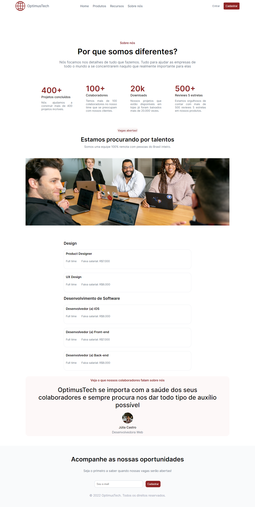

# 7 Days of Code

<h3> Uma proposta desenvolvida pela Alura, consiste em 7 dias realizando partes de um projeto em HTML e CSS. Percebo uma maior agilidade em desenvolver o projeto e realizei a responsividade que é algo que percebo a necessidade de uma maior prática. Também tentei colocar todas as ``class`` em inglês para criar um padrão e também expandir minha criatividade na língua. A experiência com #7DaysOfCode foi de uma maior disciplina, pra programar todos os dias e fazer o que foi proposto no dia.</h3>
<h3>A proposal developed by Alura, consists of 7 days carrying out a project in HTML and CSS. I perceive a need to develop the project and realize that there is a greater need for greater practice. I also tried to put all the ``class`` in English to create a pattern and also expand my creativity in the language. The experience with #7DaysOfCode was one of greater discipline, to program every day and do what was proposed on the day.<h3>

<h2 align="center">Obrigada por acompanhar minha evolução | 
Thanks for following my evolution. ❤️ </h2>
